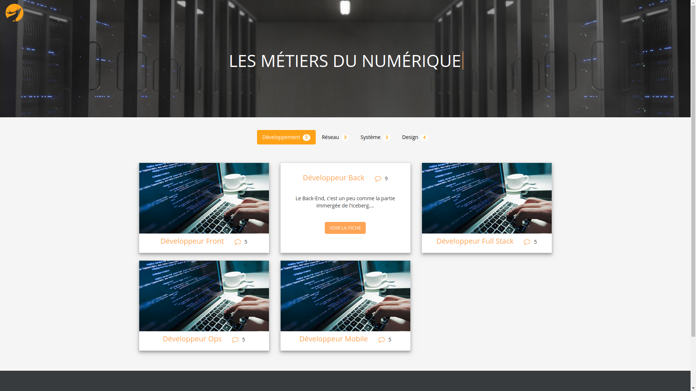
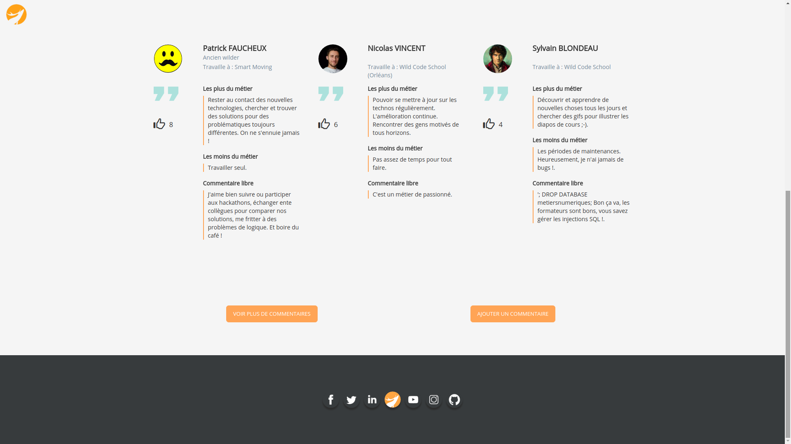

# Digital professions

## Description

"I work in IT ..." Yes but still? What does that mean ? What are the trades behind ? This site aims to enlighten you on the issue.
Follow the guide !

This application aims to introduce the digital professions to people wishing to pursue a career in this field.

This is our second project for the Wild Code School in Orleans.
The site is administrable via an administration part but the `.htaccess` file is not yet functional.

## Installation

1. Clone the repos from Github.
2. Run `composer install`.
3. Create `app/db.php` from `app/db.php.dist` file and add your DB parameters.
4. Create the database with the file `metiers_numerique.sql`.
5. Go to `public/` directory and run a server on index.php with `php -S localhost:8000`.
6. Test on your localhost default URL : `localhost:8000`.

#### Administration access
The administration parts are accessible via the following paths: `/admin/comment` and `/admin/themes-jobs`.
