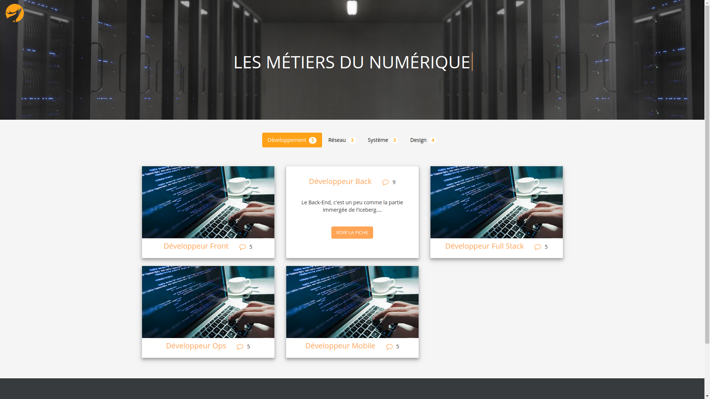
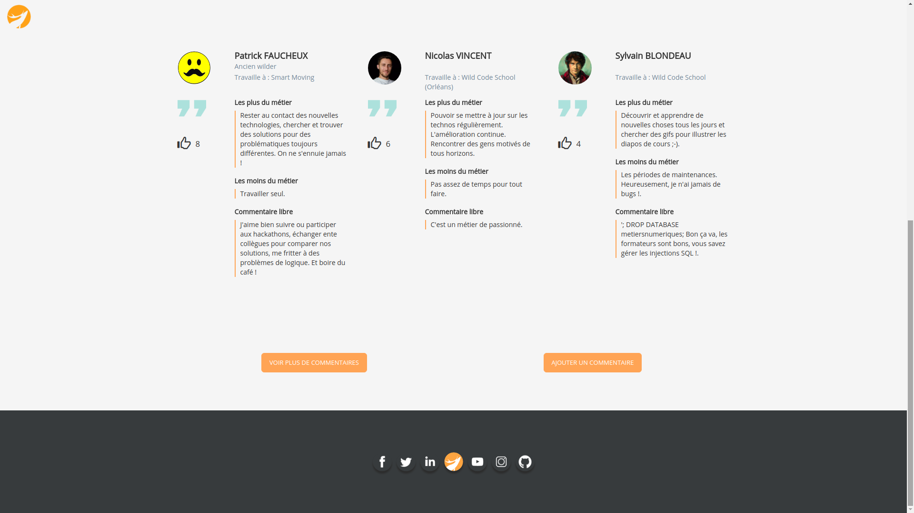

# business-to-digital




## Description

This web application is the second project of the Orleans Wild Code School (February 2018 session).

Find the list of developers who participated in the project at the end of this *readme*.

> "I work in IT ..." Yes but still? What does that mean ? What are the trades behind ? This site aims to enlighten you on the issue.
> Follow the guide !

This application aims to introduce the digital professions to people wishing to pursue a career in this field.

This is our second project for the Wild Code School in Orleans.

The site is administrable via an administration part but the `.htaccess` file is not yet functional.

## Installation

Clone the repository and move in :
```
$ git clone https://github.com/JuAlexandre/business-to-digital.git
$ cd business-to-digital
```

Install dependencies :
```
composer install
```

Create `app/db.php` from `app/db.php.dist` file and add your DB parameters :
```
define('APP_DB_HOST', 'your_db_host');
define('APP_DB_NAME', 'your_db_name');
define('APP_DB_USER', 'your_db_user_wich_is_not_root');
define('APP_DB_PWD', 'your_db_password');
```

Create the database with the file `metiers_numerique.sql`.

Run a server on index.php with :
```
php -S localhost:8000 -t public
```

#### Administration access

The administration parts are accessible via the following paths: `/admin/comment` and `/admin/themes-jobs`.

## Authors

* [Julia LIMOUSIN](https://github.com/1A2Z3E4R)
* [Steven GRILLON](https://github.com/StevenGrl)
* [Cyril DO](https://github.com/cyrildo)
* [Thomas HUBERT](https://github.com/Thomash45)
* [Julien ALEXANDRE](https://github.com/JuAlexandre)